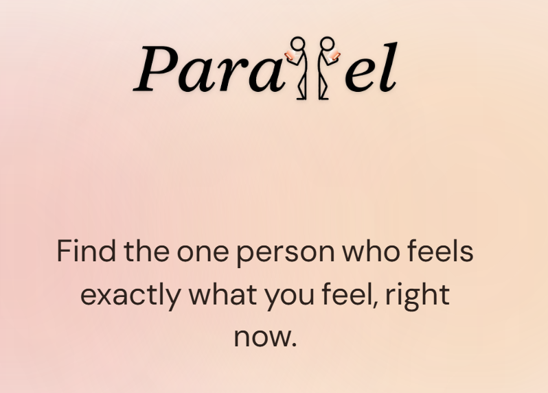

# Parallel



> *Find the stranger having your exact day.*

Parallel is an ephemeral, AI-powered journaling app that connects two anonymous strangers experiencing the same emotional moment — for exactly 24 hours.

---

## What It Is

It's 1am. Something happened today — not catastrophic, just heavy. You open your phone, scroll your contacts, and put it down. You don't want to explain the backstory. You just want someone who *gets it right now.*

Parallel is built for that moment.

You write an unfiltered journal entry. The AI reads it, builds an emotional fingerprint from it, and finds the one stranger in the pool feeling the exact same way — not by matching keywords, but by matching the *shape* of the feeling. "I feel invisible at work" matches "my family doesn't see me." Same emotional vector, zero word overlap.

When a match is found, an AI reads both private entries and writes a single empathetic icebreaker question — something neither person would have thought to ask. The two strangers talk anonymously for 24 hours. When the timer hits zero, the conversation dissolves forever. No history. No follow. No obligation.

---

## How It Works

**1. Write**
You're given a blank page and a prompt: *"What's sitting with you right now?"* A minimum of 50 words. No audience. No filter.

**2. Match**
The backend converts your entry into a 3072-dimensional semantic embedding (Google Gemini). It runs a cosine similarity search across all unmatched entries in the pool. If a match scores above the threshold, both entries are locked and a chat room is created. If not, you wait — the system keeps trying.

**3. The Icebreaker**
The AI reads both entries and generates one opening question tailored to what both people are carrying. No blank canvas awkwardness.

**4. Talk**
A live, anonymous chat room opens. A countdown begins from 24:00:00. Progressive identity chips let you optionally share your first name or city — but only when you're ready. When the timer hits zero, the room is gone.

**5. Sunset**
The conversation closes gracefully. No archive. No receipts. The constraint is the point.

---

## Tech Stack

| Layer | Technology |
|---|---|
| Frontend | Next.js 16 (App Router), TypeScript, Tailwind CSS v4, Framer Motion |
| Auth | Firebase Authentication (Google OAuth) |
| Realtime chat | Supabase Realtime (broadcast channels) |
| Backend | FastAPI (Python), stateless REST API |
| AI — Embeddings | Google Gemini (`gemini-embedding-001`, 3072 dimensions) |
| AI — Icebreaker | GPT-4o-mini via Lava proxy |
| Vector search | MongoDB Atlas Vector Search (cosine similarity) |
| Background jobs | APScheduler (room expiry, guardian agent scaffold) |

### Architecture in brief

The **frontend** (Next.js) handles all UI, auth sessions, and page transitions. The Next.js client explicitly manages Firebase tokens and attaches these Bearer tokens to every call to the backend. Real-time messaging bypasses the backend entirely — both clients in a matched pair connect directly to the same Supabase broadcast channel.

The **backend** (FastAPI) is a stateless orchestrator. It never touches chat messages. Its two jobs are: (1) run the vector match pipeline when an entry is submitted, and (2) serve room metadata to authenticated participants. A background scheduler marks rooms expired when their 24-hour window closes.

---

## Repository Structure

```
Parallel/
├── frontend/          # Next.js app
├── backend/           # FastAPI server
└── parallel-pitch.html
```

See [`frontend/README.md`](./frontend/README.md) and [`backend/README.md`](./backend/README.md) for setup instructions.
